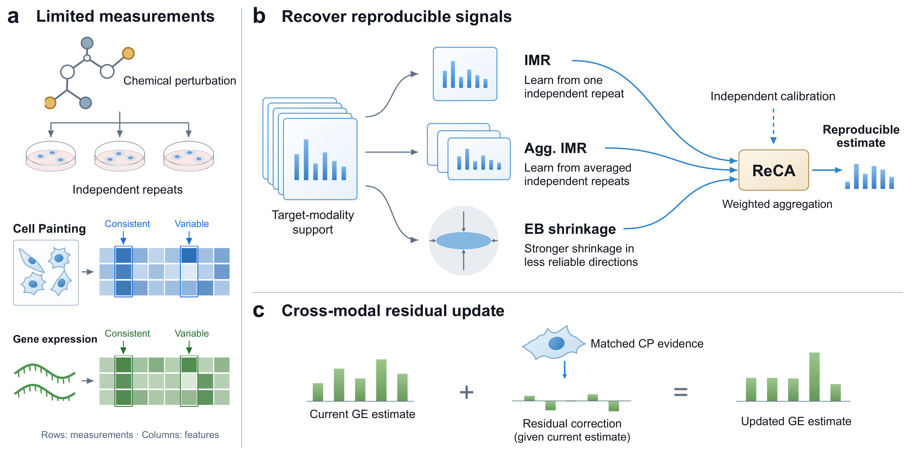
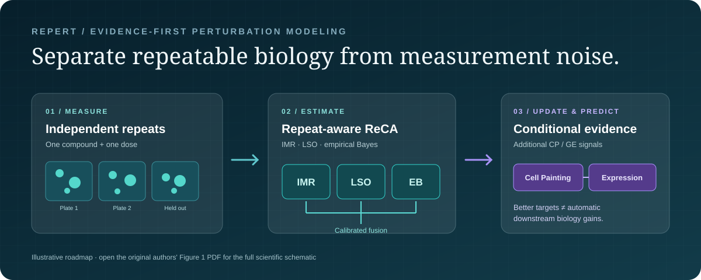

<a id="top"></a>

<div align="center">

# RePert
### 基于独立测量的可重复细胞扰动响应估计

<p>
<a href="https://zhao-weijing.github.io/RePert-code/"></a>
<a href="figures/data/figure_1/figure1_authors.pdf"></a>
<a href="LICENSE"></a>
</p>

**从独立实验中恢复可重复的扰动信号，再利用互补模态进行条件更新。**

[English](README.md) · **简体中文**

[🌐 项目主页](https://zhao-weijing.github.io/RePert-code/) · [🧭 方法框架](#-方法框架) · [📊 主要结果](#-主要结果) · [🚀 快速开始](#-快速开始) · [🧪 复现说明](#-复现说明)

</div>

## 🧬 项目摘要

**RePert** 研究在实验重复有限、观测噪声显著时，如何可靠地估计细胞扰动响应。项目使用来自独立采集板（acquisition plates）的重复测量，区分具有药物特异性的可重复信号与共享背景结构；通过独立重复回归（IMR）、排除输入板的监督（LSO）、经验贝叶斯收缩（IMCEB）与验证集校准融合（ReCA）构造响应估计。随后分析 Cell Painting（CP）和基因表达（GE）在已有估计之外能否提供真实的**条件增量信息**，并检验改进后的监督信号能否提升未见扰动的预测。结果表明重复一致性与部分形态学表型可改善，但不能据此假定 MoA/靶点/通路检索或跨细胞系迁移一定受益。

<p align="center">
<a href="figures/data/figure_1/figure1_authors.pdf"></a><br>
<sub><b>Figure 1.</b> 从作者原始 PDF 直接渲染，未修改科学图示内容。<a href="figures/data/figure_1/figure1_authors.pdf">查看高分辨率原始 PDF ↗</a> · <a href="https://zhao-weijing.github.io/RePert-code/#figure1">项目主页图示 ↗</a></sub>
</p>

<details><summary><b>🧭 查看三阶段简化示意</b></summary><p align="center"></p></details>

<a id="-方法框架"></a>
## ✨ 方法框架

| 模块 | 科学问题 | 主要实现 |
| :--- | :--- | :--- |
| 🔁 **重复响应估计** | 少量实验重复中哪些响应可信？ | IMR、LSO、IMCEB 和验证集校准融合 ReCA |
| 🧩 **跨模态条件更新** | 另一模态在已有证据之外还能增加什么？ | CP ↔ GE 残差更新、正确配对与打乱/匹配外源对照 |
| 🧠 **预测监督** | 可靠的实验估计能否转化为未见扰动预测收益？ | Raw、ReCA、ReCA+Residual 等监督目标 |

**重要区分：** ReCA 主要估计*已经观测过的扰动*的响应，并不直接解决给定功能目标时的逆向干预推荐。

<a id="-主要结果"></a>
## 📊 主要结果

以下数据均来自仓库的冻结结果；`E` 为对同一扰动与不同扰动在独立重复上的 Fisher-z 特异性指标，数值越高越好。

| 观测重复数 | Raw `E` | ReCA `E` | Raw mAP@33 | ReCA mAP@33 |
| :---: | ---: | ---: | ---: | ---: |
| 1R | 0.1895 | **0.2212** | 0.4733 | **0.4845** |
| 2R | 0.2294 | **0.2542** | 0.4974 | **0.5113** |
| 3R | 0.2692 | **0.2821** | 0.5174 | **0.5252** |

来源：[Figure 2 原始数值](figures/data/figure_2/)。

在 BBBC047 固定独立 CP 参考的实验中，单次 CP 测量后引入 GE 的条件增益为 **+0.0194 Fisher-z**（95% CI [0.0173, 0.0216]）；已有两次 CP 测量时增益仍为 **+0.0149** [0.0129, 0.0168]。这说明另一模态包含额外信息，但不是不同测量可以相互替代的证明。

此外，形态学模块和剂量轨迹一致性有所改善；但 [MoA/靶点/通路检索](figures/data/figure_4/figure4_D_downstream_boundaries.csv)并没有普遍明确的提升，[跨细胞系估计器直接迁移](figures/data/figure_4/figure4_E_direct_estimator_transfer_boundary.csv)还可能退化。需要将**测量收益、预测收益与下游生物学价值**严格区分。

## 🧫 数据资源

| 数据集 | 细胞背景 | 模态 | 特征维度 |
| :--- | :--- | :--- | :--- |
| BBBC047 / Rosetta | U2OS | CP + L1000 GE | 775 + 977 |
| cpg0004-LINCS | A549 | CP | 242 |
| sci-Plex3 | A549、K562、MCF7 | GE pseudobulk | 2,000 |

公开仓库提供数值源数据、分析脚本和合成示例，**不包含完整上游处理后的实验数据、训练检查点与全部冻结配置**。数据来源和获取方式见 [docs/data_access.md](docs/data_access.md)。

<a id="-快速开始"></a>
## 🚀 快速开始

需要 Python 3.10+ 与 NumPy。下列示例仅使用仓库自带的合成数据，不需要下载真实实验数据：

```bash
git clone https://github.com/Zhao-weijing/RePert-code.git
cd RePert-code
python -m venv .venv
source .venv/bin/activate
python -m pip install numpy
python scripts/run_estimator_example.py
python scripts/verify_package.py
```

输出位于 `outputs/example/`。示例只验证估计器与融合权重的软件行为，**不是论文实验复现**。

<a id="-复现说明"></a>
## 🧪 复现说明

根据冻结结果重建图表：

```bash
python -m pip install -r requirements-publication.txt
python figures/scripts/build_main_figures.py
python tables/predictor/scripts/build_predictor_table.py
python scripts/build_source_data_workbooks.py
```

完整上游训练依赖仓库尚未包含的处理数据、冻结 split、checkpoint 和外部依赖版本，**目前未验证能从头完整复现**。请阅读 [复现说明](docs/reproduction.md) 与 [发布状态](metadata/release_status.json)，不要把重新绘制冻结数据图表理解为重训练。

### 🗂️ 代码导航

| 内容 | 路径 |
| :--- | :--- |
| 🔁 响应估计与校准 | [`analysis/repeat_calibration/`](analysis/repeat_calibration/) |
| 📏 评估指标与基线 | [`analysis/baselines/`](analysis/baselines/) |
| 🧩 跨模态证据更新 | [`analysis/cross_modal/`](analysis/cross_modal/) |
| 🧫 数据集评估 | [`analysis/benchmarks/`](analysis/benchmarks/) · [`analysis/external_validation/`](analysis/external_validation/) |
| 🧠 扰动预测监督 | [`analysis/predictor_supervision/`](analysis/predictor_supervision/) |
| 📊 图表与源数据 | [`figures/`](figures/) · [`data/`](data/) · [`tables/`](tables/) |

## 📃 开源许可

代码采用 [MIT 协议](LICENSE)；第三方数据与软件分别遵循原有许可。论文全文未包含在当前代码包中，尚无归档 DOI。

---

<div align="center">
<strong>可靠的扰动响应，始于可重复的实验观测。</strong><br>
<sub><a href="#top">↑ 回到顶部</a> · <a href="https://zhao-weijing.github.io/RePert-code/">项目主页 ↗</a></sub>
</div>
